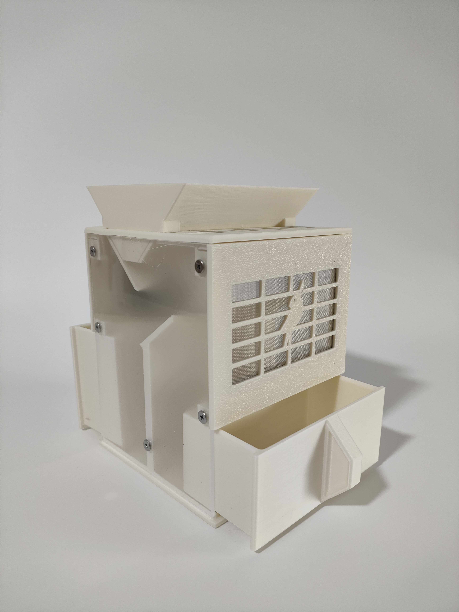
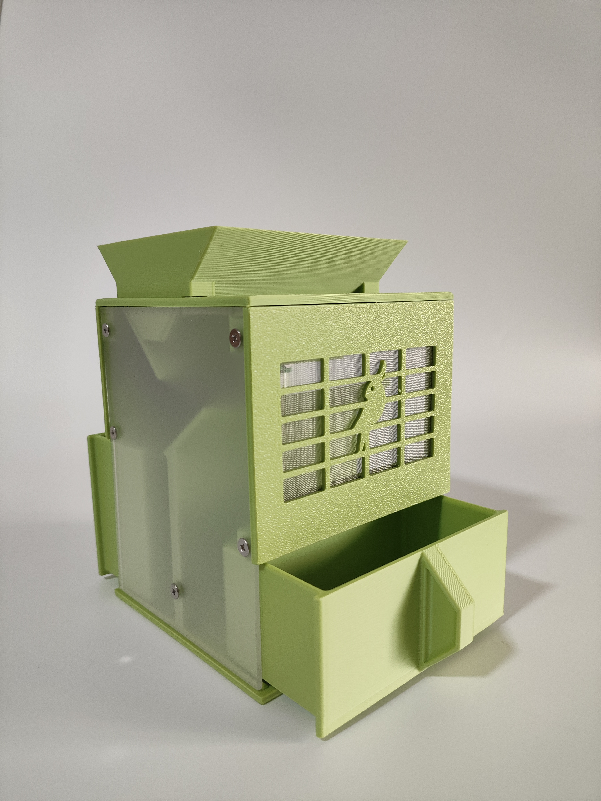
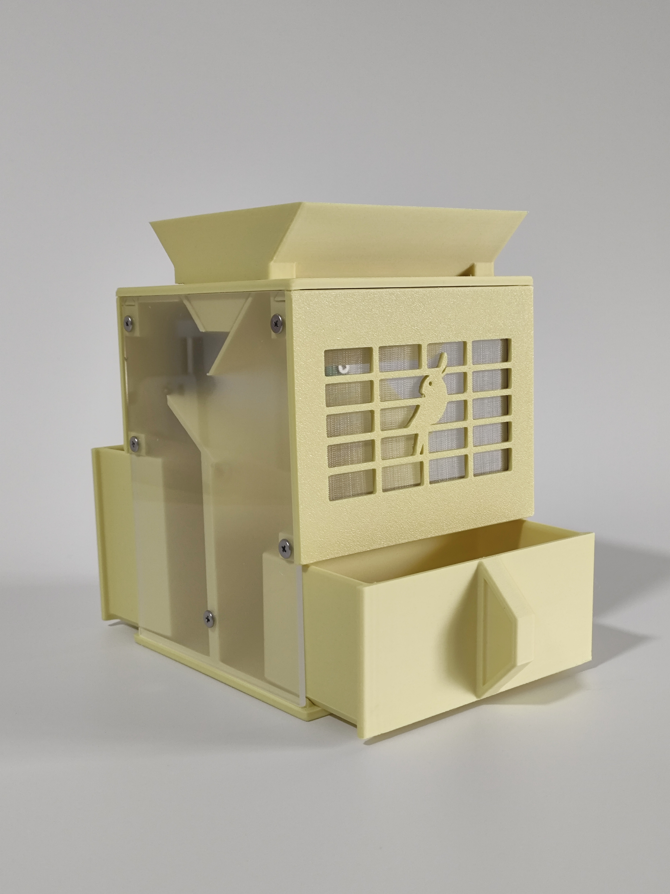
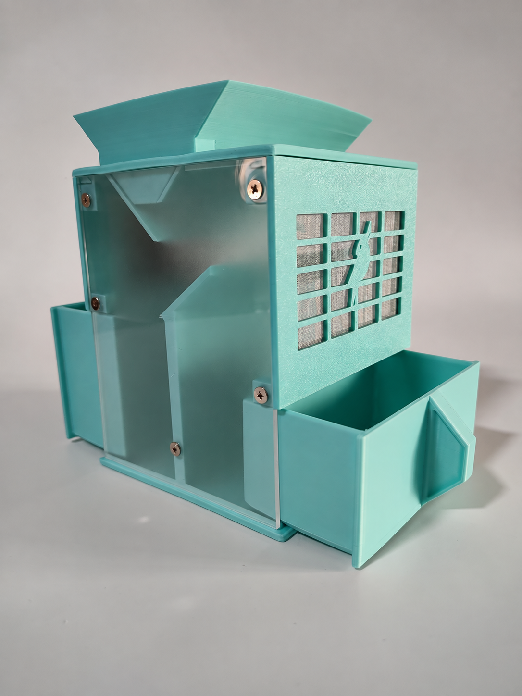
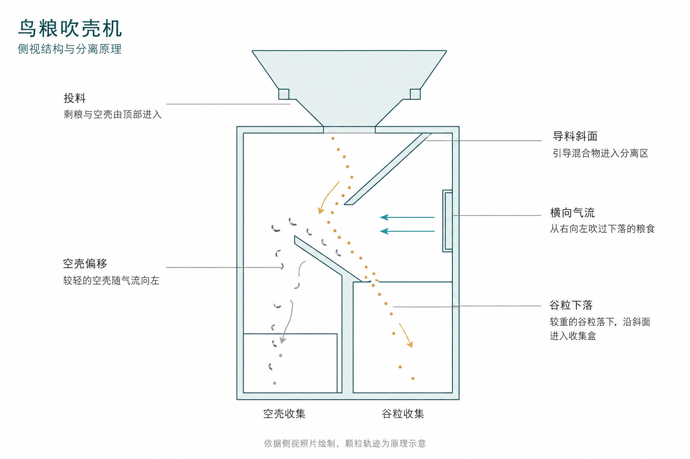

# 鸟粮吹壳机

**把剩粮中的空壳分离出来，让日常清理鸟粮更省事。**

## 灵感来源

鹦鹉吃粮食，很常见的吃一半丢一半，剩下的粮食在食盒底部懒得扒拉，最开始我每次都直接倒掉，但是我妈就说我浪费，当然，确实浪费。

我妈说浪费，同时她也开始行动，她把我老爹吃药的长方体形状的药盒剪成簸箕形状，再把吃剩的鸟粮一下一下颠出去，就像小时候的某个场景（似乎是农作物相关的操作）。

嗯，这真是个费力的操作，于是我去搜了下有无相关产品，还真有！是木制的一种分离装置，但是，网上居然要卖100块钱！

自己做明明很简单呐，说做就做，我和一个朋友聊了聊，他是机械出身，设计外壳轻轻松松，此时是2023年11月，我俩花了大概一周设计验证，选电机，选电路板，3D打印，调参数，不到一个月就完善了，用我家鸟粮测试下，效果很棒！

再然后，我俩意识到这是一个商机，虽然鹦鹉是小众宠物，但是全国养鸟的怎么也得好几万，甚至十几万人吧！

后续证明我们当时，确实，巧合的，抓住了市场的空挡，这个产品已经被1万多鸟友使用过，大家反馈还都不错。

只不过我们当时没有大力扩张，只是把3D打印机加到了十几台，随着时间的流逝，从最开始的供不应求，到现在市场上各种更便宜的竞品，我们的鸟粮吹壳机已经隐身了。

不过，我们的设计简洁大方，有着朴素却带着质感的taste，还是偶尔有鸟友因为这个设计光顾，我倍感欣慰。

## 产品介绍

鸟粮吹壳机是一件用于整理鹦鹉剩粮的养鸟工具。将混有空壳的鸟粮从顶部倒入，利用气流分离，再用两个抽屉式收集盒分别承接谷粒与空壳，方便取出和清理。

分类：养鸟工具 / 粮壳分离  
展示版本：v2.1

### 主要功能

- **分离谷粒与空壳**：处理鹦鹉进食后混有谷壳的剩粮，减少手工挑拣和吹壳的麻烦。
- **分别收集、方便清理**：两个收集盒可独立抽出，便于取出谷粒、倒掉空壳并清理残留。
- **观察分离过程**：透过透明侧板查看内部结构和粮食下落情况。

### 实物展示

冰蓝色实物，可看到顶部料斗、透明侧板和抽屉布局。

<table>
  <tr>
    <td align="center" valign="bottom">
       
      奶白色
    </td>
    <td align="center" valign="bottom">
       
      牛油果色
    </td>
    <td align="center" valign="bottom">
       
      黄色
    </td>
    <td align="center" valign="bottom">
       
      冰蓝色
    </td>
  </tr>
</table>

### 演示视频

[▶ 在 B 站观看鸟粮吹壳机演示](https://www.bilibili.com/video/BV1d34y1F7yS/?p=1)

[▶ 在 B 站观看鸟粮吹壳机演示（第二段）](https://www.bilibili.com/video/BV1vt4y1d7Rq/?p=1)

## 设计思路

### 利用气流，让谷粒与空壳走向不同位置

谷粒与空壳在气流中的运动表现不同：较轻的空壳更容易随气流偏移，较重的谷粒则继续下落。设计利用这一差异，将它们引向不同的收集盒。

上图依据侧视照片绘制，颗粒轨迹为原理示意，具体尺寸与分离效果以实物为准。

按图中的侧视方向，分离过程分为三个步骤：

1. **投料与导料**：混有空壳的剩粮从顶部料斗进入，经导料斜面落向分离区。
2. **气流分离**：右侧风扇产生从右向左的横向气流。混合物下落时，空壳随气流向左偏移，谷粒的偏移相对较小，继续下落。
3. **分别收集**：空壳落入左侧收集盒；谷粒落到下方斜面，沿斜面进入右侧收集盒。

这里的左右方向均以原理图为准。实际分离效果受粮食种类、风力和进料速度影响。

### 用斜面衔接投料、分离与收集

顶部料斗承接倒入的剩粮，上方导料斜面将混合物引向气流经过的区域；下方斜面承接落下的谷粒，并将其引入右侧收集盒。两块斜面配合中间的分离空间，将投料、分离和收集衔接起来。

---

[返回作品目录](../../README.md)
